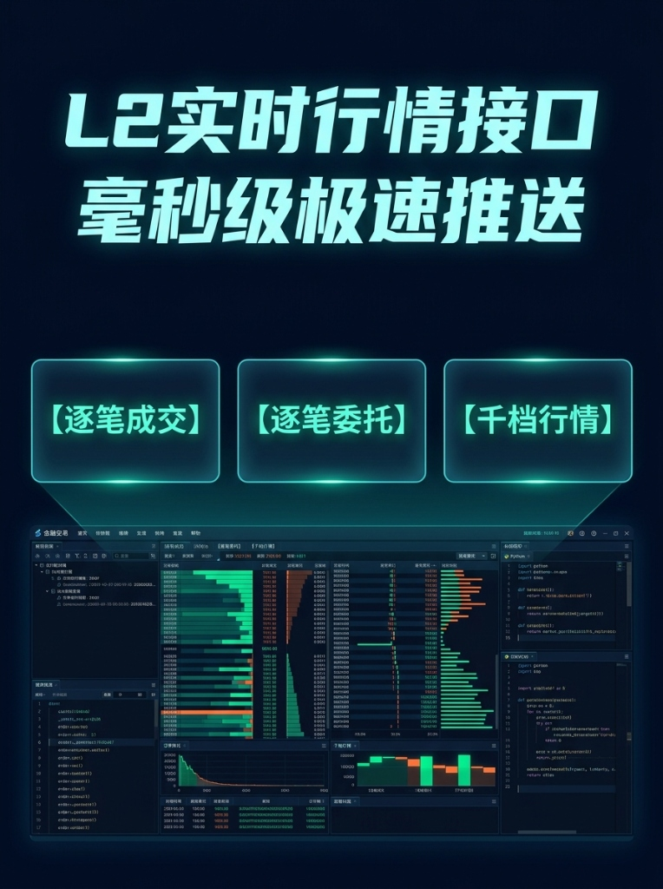

# A股 Level-2 高频行情数据中心 · 逐笔明细与千档盘口流

<div align="center">

[](https://www.python.org/)
[](#)
[](#)
[](#)
[](#)
[](#-咨询试用与技术交流)
[](LICENSE)

**专为量化交易、高频做市、订单流 (Order Flow) 策略与盘口微观结构研究打造的 A股 Level-2 高精度行情基础设施**

[🌐 在线交互看板 (Live Demo)](https://luffy953.github.io/level2-data/) · [🌟 核心优势](#-核心优势) · [📊 数据字典规范](#-数据结构与字段规范) · [🛠️ 全套量化系统搭建](#️-全套量化交易系统搭建与私有化咨询) · [💬 咨询试用](#-咨询试用与技术交流)

<br/>



</div>

---

## 📌 项目概述

在现代 A 股量化交易与超短线博弈中，普通 Level-1（3秒一次切片、仅五档买卖）存在严重的**信息滞后与微观结构盲区**，无法满足订单流失衡分析 (OFI)、主力大单撤单诱多识别、高频做市与毫秒级打板监控的需求。

**Level2-Data** 致力于打破传统商业数据源高昂的采购与接入门槛，为个人量化开发者、私募团队与独立研究员提供**全市场、低延迟、高完整度**的 A股 Level-2 高频行情解决方案。

---

## 🌟 核心优势

相比于传统券商客户端（如 QMT / miniQMT）通常受限于高额资金门槛（普遍要求 50万 ~ 100万+ 资产）、重度绑定 Windows 桌面环境、容易卡顿崩溃以及多为快照切片等痛点，本项目具备以下特点：

- 🚀 **零门槛开箱即用**：无资金资产要求，个人与机构均可快速接入；
- 🐧 **跨平台轻量解耦**：标准 WebSocket / REST 接口协议，原生完美支持 **Linux、Docker、云服务器、macOS**，真正实现 7x24h 自动化无人值守运行；
- 📊 **深度与微观穿透**：支持 **双向千档盘口深度 (1000-Level Deep OrderBook)** 与买一/卖一档位前 50 笔委托明细队列；
- ⚡ **毫秒级逐笔全量追踪**：提供全量**逐笔委托与撤单 (Tick Order)** 以及买卖单号严格匹配的**逐笔成交 (Tick Trade)**，精准捕捉大单挂撤与资金流动；
- 🔌 **灵活生态集成**：开放标准数据流，无缝对接 Python、C++、Go、Backtrader、DolphinDB、ClickHouse 等任意量化框架。

---

## 🖥️ 在线交互看板

项目自带深色金融终端交互看板，无需配置本地环境，直接点击体验千档盘口与逐笔数据流动：

👉 **[点击直接访问在线看板 (GitHub Pages)](https://luffy953.github.io/level2-data/)**

---

## 📐 数据结构与字段规范

### 1. 逐笔成交数据流 (`channel: l2.trade`)

| 字段名称 | 类型 | 说明 | 示例 |
| :--- | :--- | :--- | :--- |
| `channel` | string | 数据通道标识 | `"l2.trade"` |
| `symbol` | string | 证券代码 (带市场后缀) | `"600519.SH"` |
| `tradeSeq` | int64 | 成交唯一递增序号 | `4192084` |
| `time` | string | 毫秒撮合时间戳 | `"2026-09-23 14:58:22.480"` |
| `price` | float | 实际成交价格 (元) | `1425.80` |
| `volumeShares` | int64 | 成交股数 (股) | `2000` |
| `amount` | float | 成交金额 (元) | `2851600.00` |
| `side` | string | 内外盘方向：`B`=主动买 (外盘), `S`=主动卖 (内盘), `N`=未知 | `"B"` |
| `buyOrderId` | int64 | 买方原始申报单号 | `1849250` |
| `sellOrderId` | int64 | 卖方原始申报单号 | `1846012` |

### 2. 逐笔委托与撤单流 (`channel: l2.order`)

| 字段名称 | 类型 | 说明 | 示例 |
| :--- | :--- | :--- | :--- |
| `channel` | string | 数据通道标识 | `"l2.order"` |
| `symbol` | string | 证券代码 | `"600519.SH"` |
| `orderSeq` | int64 | 委托唯一递增序号 | `3891045` |
| `orderId` | int64 | 订单编号 | `1849120` |
| `time` | string | 申报时间戳 | `"2026-09-23 14:58:22.180"` |
| `orderType` | string | 委托类型：`BUY`(买), `SELL`(卖), `CANCEL`(撤单) | `"CANCEL"` |
| `price` | float | 申报价格 (市价单为 0 或市价类型编码) | `1426.00` |
| `volumeShares` | int64 | 申报股数 / 撤销股数 | `10000` |
| `origOrderId` | int64 | 撤单对应的原订单编号 | `1849120` |

### 3. 千档盘口与队列 (`channel: l2.depth`)

```json
{
  "channel": "l2.depth",
  "symbol": "600519.SH",
  "time": "2026-09-23 14:58:22.500",
  "lastPrice": 1425.80,
  "bids": [
    {"level": 1, "price": 1425.80, "volume": 8500, "ordersCount": 28},
    {"level": 2, "price": 1425.50, "volume": 6000, "ordersCount": 15},
    {"level": 3, "price": 1425.00, "volume": 12400, "ordersCount": 42}
  ],
  "asks": [
    {"level": 1, "price": 1426.00, "volume": 5200, "ordersCount": 19},
    {"level": 2, "price": 1426.50, "volume": 7800, "ordersCount": 23},
    {"level": 3, "price": 1427.00, "volume": 15600, "ordersCount": 56}
  ],
  "bid1Queue": [1200, 800, 2000, 500, 1000, 3000],
  "ask1Queue": [1500, 700, 1000, 2000]
}
```

---

## ⚡ 快速开始

可以使用任何支持 WebSocket 的编程语言进行订阅接入。以下为 Python 极简客户端接入示例：

```bash
pip install websocket-client
```

```python
import json
import websocket

# 获取测试 Token 请联系微信: luffy953
TOKEN = "YOUR_TRIAL_TOKEN"
WS_ENDPOINT = f"wss://quote.stream.example.com/ws/l2?token={TOKEN}"

def on_message(ws, message):
    data = json.loads(message)
    ch = data.get("channel")
    if ch == "l2.trade":
        print(f"[{data['time']}] 逐笔成交 {data['symbol']} 价格:{data['price']} 股数:{data['volumeShares']} 方向:{data['side']}")
    elif ch == "l2.depth":
        print(f"[{data['time']}] 盘口更新 {data['symbol']} 买一:{data['bids'][0]['price']} 卖一:{data['asks'][0]['price']}")

def on_open(ws):
    print(">>> 连接建立成功，开始订阅行情...")
    sub_payload = {
        "action": "subscribe",
        "symbols": ["600519.SH", "000001.SZ", "300750.SZ"],
        "channels": ["l2.trade", "l2.order", "l2.depth"]
    }
    ws.send(json.dumps(sub_payload))

if __name__ == "__main__":
    ws = websocket.WebSocketApp(WS_ENDPOINT, on_open=on_open, on_message=on_message)
    ws.run_forever()
```

---

## 🛠️ 全套量化交易系统搭建与私有化咨询

除了提供高性能 Level-2 数据接入外，我们还支持**全套量化实盘系统工程化落地与私有化部署定制**：

1. **核心数据中台与行情网关**：
   - 毫秒级高频行情接入、清洗分发、千档盘口合成、ClickHouse / DolphinDB 本地冷热存储。
2. **实时策略与因子计算引擎**：
   - 竞价抢筹异动捕捉、盘中 09:30~09:35 龙头选股模型、订单流失衡 (OFI) 因子、涨停板封单队列撤单率监控。
3. **自动化实盘交易与执行链路**：
   - 独立实盘下单通道打通（支持东方财富、同花顺等主流券商自动化下单执行）；
   - 具备独立风控拦截、多券商分仓调度、断网重连与异常止损机制。
4. **私有化部署与运维托管**：
   - 支持 Linux / Docker 纯无头环境私有化部署，提供双机热备与 7x24h 自动化健康自愈。

> 无论是个人开发者转型量化交易，还是私募团队需要自建专属交易链路，均可联系探讨全套解决方案。

---

## 💬 咨询试用与技术交流

如果你对 A 股 Level-2 高频数据感兴趣，欢迎添加微信咨询试用与交流合作：

<div align="center">


### 📱 微信：**`luffy953`**  
*(添加时请备注：**GitHub / 量化**，以便快速通过)*

</div>

- 🎯 **申请测试 Token**：体验毫秒级 WebSocket 推流与全市场 5000+ 标的实时订阅；
- 📦 **样本数据获取**：获取热门标的单日全量逐笔成交、逐笔委托与千档盘口回测文件 (Parquet / CSV)；
- 🤝 **量化方案交流**：交流微观盘口特征、订单流策略、高频回测以及实盘交易系统全套搭建。

---

## ⚠️ 免责声明 (Disclaimer)

1. 本项目所载说明、代码示例及数据展示仅供**量化策略研发、学术研究与编程技术交流**使用。
2. 本项目不提供任何投资建议，不引导参与任何实际证券交易，亦不对基于相关数据产生的任何交易盈亏承担责任。
3. 数据版权归属于各证券交易所及合法数据授权方。市场有风险，投资需谨慎。
