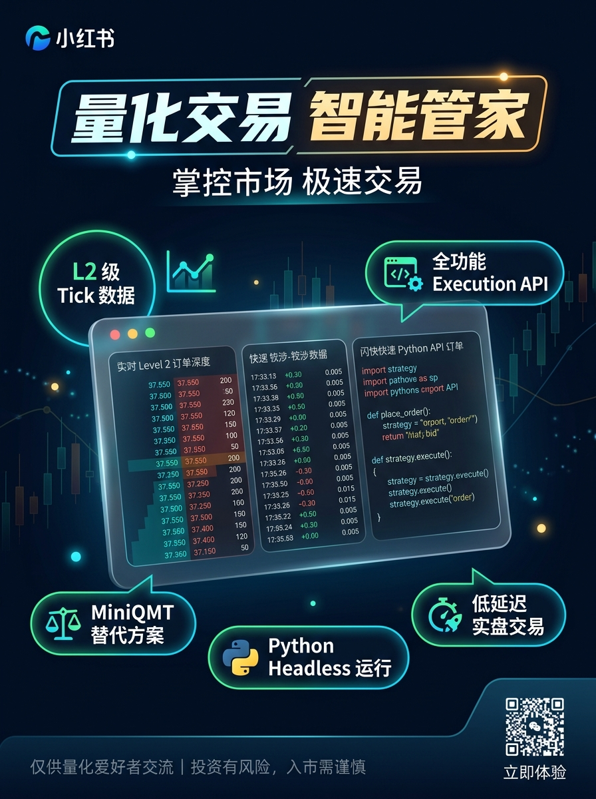

# A股 Level-2 高频行情数据中心 · 逐笔明细与千档盘口流

<div align="center">

[](https://www.python.org/)
[](#)
[](#)
[](#)
[](#)
[](#-免费试用2天与技术交流)
[](LICENSE)

**专为量化交易、高频做市、订单流 (Order Flow) 策略与盘口微观结构研究打造的 A股 Level-2 高精度行情基础设施**

[🌐 在线交互看板 (Live Demo)](https://luffy953.github.io/level2-data/) · [🔥 对比/取代 miniQMT](#-全面对比取代-miniqmt--qmt) · [📊 数据字典规范](#-数据结构与字段规范) · [🛠️ 全套量化系统搭建](#️-全套量化交易系统搭建与私有化咨询) · [🎁 申请免费试用2天](#-免费试用2天与技术交流)

<br/>



</div>

---

## 📌 项目概述

在现代 A 股量化交易与超短线博弈中，普通 Level-1（3秒一次切片、仅五档买卖）存在严重的**信息滞后与微观结构盲区**，无法满足订单流失衡分析 (OFI)、主力大单撤单诱多识别、高频做市与毫秒级打板监控的需求。

**Level2-Data** 致力于打破传统商业数据源（如 Wind、万得、恒生等每年数万至几十万元）的超高门槛，为个人量化开发者、私募团队与独立研究员提供**全市场、低延迟、高完整度**的 A股 Level-2 高频行情解决方案。

---

## 🔥 全面对比：取代 miniQMT / QMT

许多量化团队和个人投资者曾重度依赖券商提供的 miniQMT / QMT，但在实战中深受其痛点困扰。以下是核心维度对比：

| 评估维度 | 券商 miniQMT / QMT | **本项目 Level-2 行情服务** | 核心优势 |
| :--- | :--- | :--- | :--- |
| **资金准入门槛** | **极高**（通常要求 50万 ~ 100万+ 净资产才批准开通） | **零门槛（0 元开通）**，支持任意个人与团队灵活接入 | 极大地降低量化研发与实盘门槛 |
| **运行环境依赖** | **重度绑定 Windows 桌面**，必须启动庞大客户端，极占内存且易崩溃卡死 | **纯轻量标准协议**，支持 **Linux、Docker、无头云服务器、macOS** 等全平台 | 真正实现 7x24h 自动化无人值守稳定运行 |
| **盘口行情深度** | 多数仅为常规五档或受限十档切片，无深度微观分布 | **双向千档盘口 (1000-Level Deep OrderBook)** 完整展示 | 穿透底层筹码分布与大单垫单支撑阻力 |
| **逐笔委托与撤单** | 几乎不支持或延迟极高，无法分析订单申报行为 | **全量毫秒级逐笔委托 (Tick Order)**，包含申报与撤单原单号 | 精准识别游资打板撤单、虚假挂单撤销等特征 |
| **逐笔成交精度** | 普通切片成交或延迟成交数据 | **毫秒级逐笔成交 (Tick Trade)**，买卖单号严格对应，主买/主卖精准归因 | 订单流 (Order Flow) 与微观价格冲击分析利器 |
| **系统解耦与扩展** | 绑定券商沙盒，不支持外部灵活流式对接 | **标准 WebSocket / REST API**，原生支持 Python、C++、Go、Rust，无缝接入各类量化回测框架 | 便于自建量化中台与分布式集群 |

---

## 🖥️ 在线交互看板

项目自带高颜值深色金融终端交互看板，无需配置本地环境，直接点击体验千档盘口与逐笔数据流动：

👉 **[点击直接访问在线看板 (GitHub Pages)](https://luffy953.github.io/level2-data/)**

---

## 🌟 核心特性与数据流

- ⚡ **毫秒级逐笔成交 (Tick Trade)**：全市场每笔撮合毫秒时间戳、主动买卖方向 (B/S)、真实撮合量价、买卖双方原始申报单号精确匹配。
- 📋 **逐笔委托与撤单 (Tick Order)**：全量委托订单流，精准捕捉机构大单挂单、垫单、扫盘与秒级大单撤销行为。
- 📊 **千档深度盘口 (1000-Level Depth)**：超越传统十档盘口，支持双向各 1000 档位订单深度累计与微观分布。
- 🔍 **最优档位挂单队列 (Top-50 Queue)**：买一/卖一档位前 50 笔委托明细分布，拆解排队单构成。
- 🔄 **高并发稳定推流**：支持 WebSocket 订阅、断线重连、心跳保活；支持全量历史数据导出为 Parquet / CSV / ClickHouse / DolphinDB。

---

## 📐 数据结构与字段规范

### 1. 逐笔成交数据流 (`channel: l2.trade`)

| 字段名称 | 类型 | 说明 | 示例 |
| :--- | :--- | :--- | :--- |
| `channel` | string | 数据通道标识 | `"l2.trade"` |
| `symbol` | string | 证券代码 (带市场后缀) | `"600519.SH"` |
| `tradeSeq` | int64 | 成交唯一递增序号 | `4192084` |
| `time` | string | 毫秒撮合时间戳 | `"2026-09-23 14:58:22.480"` |
| `price` | float | 实际成交价格 (元) | `1425.80` |
| `volumeShares` | int64 | 成交股数 (股) | `2000` |
| `amount` | float | 成交金额 (元) | `2851600.00` |
| `side` | string | 内外盘方向：`B`=主动买 (外盘), `S`=主动卖 (内盘), `N`=未知 | `"B"` |
| `buyOrderId` | int64 | 买方原始申报单号 | `1849250` |
| `sellOrderId` | int64 | 卖方原始申报单号 | `1846012` |

### 2. 逐笔委托与撤单流 (`channel: l2.order`)

| 字段名称 | 类型 | 说明 | 示例 |
| :--- | :--- | :--- | :--- |
| `channel` | string | 数据通道标识 | `"l2.order"` |
| `symbol` | string | 证券代码 | `"600519.SH"` |
| `orderSeq` | int64 | 委托唯一递增序号 | `3891045` |
| `orderId` | int64 | 订单编号 | `1849120` |
| `time` | string | 申报时间戳 | `"2026-09-23 14:58:22.180"` |
| `orderType` | string | 委托类型：`BUY`(买), `SELL`(卖), `CANCEL`(撤单) | `"CANCEL"` |
| `price` | float | 申报价格 (市价单为 0 或市价类型编码) | `1426.00` |
| `volumeShares` | int64 | 申报股数 / 撤销股数 | `10000` |
| `origOrderId` | int64 | 撤单对应的原订单编号 | `1849120` |

### 3. 千档盘口与队列 (`channel: l2.depth`)

```json
{
  "channel": "l2.depth",
  "symbol": "600519.SH",
  "time": "2026-09-23 14:58:22.500",
  "lastPrice": 1425.80,
  "bids": [
    {"level": 1, "price": 1425.80, "volume": 8500, "ordersCount": 28},
    {"level": 2, "price": 1425.50, "volume": 6000, "ordersCount": 15},
    {"level": 3, "price": 1425.00, "volume": 12400, "ordersCount": 42}
  ],
  "asks": [
    {"level": 1, "price": 1426.00, "volume": 5200, "ordersCount": 19},
    {"level": 2, "price": 1426.50, "volume": 7800, "ordersCount": 23},
    {"level": 3, "price": 1427.00, "volume": 15600, "ordersCount": 56}
  ],
  "bid1Queue": [1200, 800, 2000, 500, 1000, 3000],
  "ask1Queue": [1500, 700, 1000, 2000]
}
```

---

## ⚡ 快速开始

可以使用任何支持 WebSocket 的编程语言进行订阅接入。以下为 Python 极简客户端接入示例：

```bash
pip install websocket-client
```

```python
import json
import websocket

# 获取 2 天免费测试 Token 请联系微信: luffy953
TOKEN = "YOUR_TRIAL_TOKEN"
WS_ENDPOINT = f"wss://quote.stream.example.com/ws/l2?token={TOKEN}"

def on_message(ws, message):
    data = json.loads(message)
    ch = data.get("channel")
    if ch == "l2.trade":
        print(f"[{data['time']}] 逐笔成交 {data['symbol']} 价格:{data['price']} 股数:{data['volumeShares']} 方向:{data['side']}")
    elif ch == "l2.depth":
        print(f"[{data['time']}] 盘口更新 {data['symbol']} 买一:{data['bids'][0]['price']} 卖一:{data['asks'][0]['price']}")

def on_open(ws):
    print(">>> 连接建立成功，开始订阅行情...")
    sub_payload = {
        "action": "subscribe",
        "symbols": ["600519.SH", "000001.SZ", "300750.SZ"],
        "channels": ["l2.trade", "l2.order", "l2.depth"]
    }
    ws.send(json.dumps(sub_payload))

if __name__ == "__main__":
    ws = websocket.WebSocketApp(WS_ENDPOINT, on_open=on_open, on_message=on_message)
    ws.run_forever()
```

---

## 🛠️ 全套量化交易系统搭建与私有化咨询

除了提供高性能 Level-2 数据接入外，我们还支持**全套量化实盘系统工程化落地与私有化部署定制**：

1. **核心数据中台与行情网关**：
   - 毫秒级高频行情接入、清洗分发、千档盘口合成、ClickHouse / DolphinDB 本地冷热存储。
2. **实时策略与因子计算引擎**：
   - 竞价抢筹异动捕捉、盘中 09:30~09:35 龙头选股模型、订单流失衡 (OFI) 因子、涨停板封单队列撤单率监控。
3. **自动化实盘交易与执行链路**：
   - 独立实盘下单通道打通（支持东方财富、同花顺等主流券商自动化下单执行）；
   - 具备独立风控拦截、多券商分仓调度、断网重连与异常止损机制。
4. **多端协同与风控看板**：
   - 网页端实时监控看板、钉钉/微信/企业微信异动毫秒级推送报警。

> 无论是个人开发者转型量化交易，还是私募团队需要自建专属交易链路，均可联系探讨全套解决方案。

---

## 🎁 免费试用 2 天与技术交流

我们为 GitHub 开源社区的量化同行提供**限时 2 天全功能免费试用权限**：

<div align="center">


### 📱 微信联系：**`luffy953`**  
*(添加时请备注：**GitHub / 量化**，以便优先开通)*

</div>

### 🎯 专享福利：
1. **免费开通 2 天实时 WebSocket API 试用权限**：
   - 独立 API 接入 Token，直接订阅全市场 5000+ 股票、ETF、可转债的千档盘口与逐笔数据流。
2. **免费领取历史高精度逐笔样本包**：
   - 包含贵州茅台 (600519)、宁德时代 (300750) 等核心标的**单日全量逐笔成交、逐笔委托与千档盘口文件** (Parquet / CSV / JSON)。
3. **全套量化交易架构咨询**：
   - 探讨 micro-structure 盘口特征、高频做市、实盘自动下单与券商通道替代方案。

---

## ⚠️ 免责声明 (Disclaimer)

1. 本项目所载说明、代码示例及数据展示仅供**量化策略研发、学术研究与编程技术交流**使用。
2. 本项目不提供任何投资建议，不引导参与任何实际证券交易，亦不对基于相关数据产生的任何交易盈亏承担责任。
3. 数据版权归属于各证券交易所及合法数据授权方。市场有风险，投资需谨慎。
